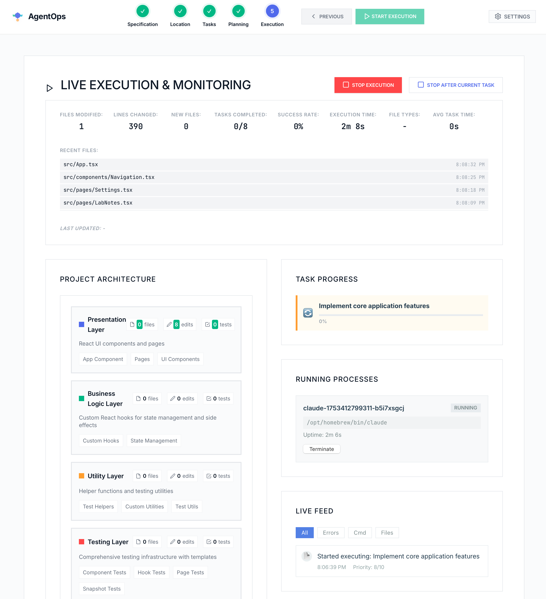

# AgentOps

AgentOps is an AI agent monitoring, control, and workflow visualization platform that brings DevOps principles to AI agent development. It provides real-time oversight and management of AI agents like Claude Code throughout the entire development lifecycle.




## 🚀 Features

### Current (Phase 3 Advanced Complete)
- **🏗️ Visual Architecture Diagrams** - Real-time project architecture visualization with layer-based components
- **📊 Live Execution Metrics** - Real-time file modification tracking during task execution with 3-second polling intervals
- **📈 Smart File Analysis** - Automatic detection of code files, lines changed estimation, and file type breakdown
- **🕒 Recent Files Timeline** - Live display of recently modified files with timestamps during execution
- **🎯 Smart Instance Management** - Never creates more agent instances than available tasks
- **⚡ Simplified Execution Control** - Clean "Stop" and "Stop After Current Task" controls (no confusing pause states)
- **🔄 Long-Running Task Support** - Tasks can run for minutes with proper timeout handling (5+ minute support)
- **🤖 Claude-Powered Specifications** - Integrated Claude AI workflow for comprehensive product specifications
- **📁 Real File System Navigation** - Browse and select project directories with full navigation
- **🎯 5-Step Workflow Management** - Complete end-to-end project workflow from specification to execution
- **📈 Enhanced Execution Monitoring** - Real-time metrics with architecture highlighting during task execution
- **🔍 Activity Parsing & Classification** - Intelligent categorization of all AI agent activities
- **💻 Multi-Instance Claude Management** - Optimal instance creation based on actual workload needs
- **🔄 AI-Powered Task Generation** - Dynamic task identification using real Claude Code CLI integration with full tool permissions
- **🔧 Git Integration** - Seamless git commit workflow when execution is paused or stopped
- **⚡ Real Task Execution** - Claude CLI now has proper Write/Read/Bash/Edit tool permissions for actual file operations
- **🎨 Neural Purple Brand System** - Professional color palette with Linear/Uizard-inspired aesthetics
- **✨ Modern UI Components** - Inter typography, Lucide SVG icons, and contemporary design patterns


## 🛠️ Technology Stack

- **Frontend**: HTML5, CSS3, JavaScript (ES6+)
- **Backend**: Node.js, Express
- **Real-time**: WebSocket (ws)
- **File Monitoring**: Chokidar
- **Process Management**: Node.js child_process
- **Activity Parsing**: Custom pattern recognition engine
- **Testing**: Jest with 88.46% coverage, 114+ tests across 7 suites
- **Quality**: 84% branch coverage, comprehensive API route testing
- **Architecture**: Modular design with extracted API routes and WebSocket handlers
- **Future**: React/TypeScript, Electron, Mobile apps

## 📋 Prerequisites

- Node.js 18+ and npm
- Claude Code CLI installed and configured
- Modern web browser (Chrome, Firefox, Safari, Edge)

## 🎯 Quick Start

1. **Clone the repository**
   ```bash
   git clone <repository-url>
   cd CodingAgentWorkflow
   ```

2. **Install dependencies**
   ```bash
   npm install
   ```

3. **Start the development server**
   ```bash
   npm start
   ```

4. **Open your browser**
   ```
   http://localhost:3000
   ```

## 🎮 Usage

### 🤖 5-Step Workflow Process

#### Step 1: Claude-Powered Project Specification
- **Claude Integration** - Direct workflow integration with Claude AI
- **Comprehensive Specifications** - Generate detailed product specifications including vision, features, technical requirements, and risk assessment
- **Smart Parsing** - Automatic extraction of project details from markdown specifications
- **One-Click Prompt** - Pre-built prompts for optimal Claude interactions

#### Step 2: Project Directory Selection  
- **Real File System Navigation** - Browse and select project directories with full folder navigation
- **Smart Monitoring Setup** - Configure file monitoring, git tracking, and command execution monitoring
- **Project Analysis** - Automatic project scanning and configuration

#### Step 3: AI-Powered Task Identification
- **Intelligent Task Generation** - AI analyzes specifications to generate relevant development tasks
- **Task Prioritization** - Automatic priority assignment based on project requirements
- **Custom Task Creation** - Add custom tasks through intuitive modal interface
- **Task Selection** - Choose which tasks to include in execution plan

#### Step 4: Execution Planning & Configuration
- **Task Ordering** - Organize tasks in optimal execution sequence
- **Execution Modes** - Choose from step-by-step, semi-automatic, or fully automatic execution
- **Instance Management** - Configure maximum number of concurrent Claude Code instances
- **Settings Validation** - Ensure execution plan is ready for deployment

#### Step 5: Live Execution & Monitoring
- **Real-time File Metrics** - Live tracking of files modified, lines changed, new files created, and file type breakdown during task execution
- **Recent Files Timeline** - Live display of recently modified files with timestamps and file paths
- **Smart File Analysis** - Automatic filtering of code files and intelligent change detection
- **3-Second Polling Updates** - Real-time metrics updated every 3 seconds during active task execution
- **Advanced Execution Control** - Pause/Stop after next task completion for graceful workflow management
- **Claude Instance Monitoring** - Live status of all running Claude Code processes
- **Activity Timeline** - Real-time stream of all agent activities with intelligent filtering
- **Git Integration** - Seamless commit workflow when execution is paused or stopped
- **Loop Prevention** - Smart handling for existing projects with continuous improvement suggestions

### 🔧 Advanced Features
- **WebSocket Real-time Updates** - Live communication between frontend and backend
- **Activity Classification** - Intelligent parsing of commands, errors, completions, and more
- **Multi-Instance Support** - Concurrent management of up to 10 Claude Code agents
- **File System Integration** - Real-time monitoring of project changes and modifications

## 📖 API Documentation

### REST Endpoints

#### Claude Code Instance Management
```bash
# Get all instances
GET /api/v1/claude-code/instances

# Create new instance
POST /api/v1/claude-code/instances
{
  "command": "claude code --help",
  "options": { "cwd": "/path/to/project" }
}

# Terminate instance
DELETE /api/v1/claude-code/instances/:id

# Send input to instance
POST /api/v1/claude-code/instances/:id/input
{
  "input": "help\n"
}

# Get Claude Code status and availability
GET /api/v1/claude-code/status

# Auto-detect Claude Code installation
GET /api/v1/claude-code/detect

# Test Claude Code connection
POST /api/v1/claude-code/test
{
  "path": "/opt/homebrew/bin/claude",
  "args": ["--model", "sonnet", "--max-tokens", "8000"]
}
```

#### File Monitoring
```bash
# Get monitoring status
GET /api/v1/monitoring/status

# Start monitoring
POST /api/v1/monitoring/start
{
  "projectPath": "/path/to/project",
  "options": { "ignored": ["*.log"] }
}

# Stop monitoring
POST /api/v1/monitoring/stop
{
  "projectPath": "/path/to/project"
}
```

#### Activity Management
```bash
# Get recent activities
GET /api/v1/activities?limit=50&type=error

# Get activity statistics
GET /api/v1/activities/statistics

# Search activities
POST /api/v1/activities/search
{
  "query": "error",
  "filters": { "minImportance": 7, "type": "error" }
}

# Clear all activities
DELETE /api/v1/activities

# Browse file system
GET /api/v1/filesystem/browse?path=/path/to/directory

# Generate tasks with AI
POST /api/v1/claude-code/generate-tasks
{
  "prompt": "Generate development tasks for this Node.js project",
  "projectContext": {
    "projectPath": "/path/to/project",
    "isExisting": true
  }
}

# Commit changes to git
POST /api/v1/git/commit
{
  "message": "Update: Task completion via AgentOps",
  "projectPath": "/path/to/project"
}

# Get live execution metrics
GET /api/v1/claude-code/live-metrics/:projectPath?timeWindow=180000
# Returns real-time file modification statistics during task execution
```

### WebSocket Events
```javascript
// Connect to WebSocket
const ws = new WebSocket('ws://localhost:3000');

// Instance events
ws.send(JSON.stringify({
  type: 'spawnInstance',
  command: 'claude code --help'
}));

// Monitoring events
ws.send(JSON.stringify({
  type: 'startMonitoring',
  projectPath: '/path/to/project'
}));

// Listen for real-time events
ws.onmessage = (event) => {
  const data = JSON.parse(event.data);
  switch(data.type) {
    case 'instanceCreated':
    case 'processOutput':
    case 'fileChange':
    case 'activityParsed':
      // Handle events
      break;
  }
};
```

## 🗂️ Project Structure

```
CodingAgentWorkflow/
├── public/                 # Frontend Application (Phase 3 Complete)
│   ├── index.html          # 5-step workflow interface with Claude integration
│   ├── styles.css          # Modern responsive styling with animations
│   └── app.js              # AgentOpsWorkflow class with real-time features
├── src/                    # Backend Services
│   ├── process-manager.js  # Claude Code process management
│   ├── file-monitor.js     # File system monitoring with Chokidar
│   ├── activity-parser.js  # Intelligent activity parsing and classification
│   ├── api-routes.js       # REST API routes + File system browsing
│   └── websocket-handler.js # WebSocket connection management
├── test/                   # Test suites (114+ tests, enhanced coverage)
│   ├── api-routes.test.js      # Comprehensive API testing (53 tests - all passing)
│   ├── websocket-handler.test.js
│   ├── server-integration.test.js
│   ├── activity-parser.test.js
│   ├── process-manager.test.js
│   ├── file-monitor.test.js
│   └── server.test.js
├── server.js               # Express server and WebSocket integration
├── package.json            # Dependencies and scripts
├── CLAUDE.md               # Development guidance
└── README.md              # This file
```

## 🔧 Development

### Scripts
```bash
npm start         # Start production server
npm run dev       # Start development server
npm test          # Run test suite (114+ tests - all passing)
npm run test:watch    # Run tests in watch mode
npm run test:coverage # Run tests with coverage report
```

### Architecture
- **Event-Driven**: All components communicate via EventEmitter
- **Real-time**: WebSocket integration for live updates and activity streaming
- **Modular**: Separate modules for process, file, and activity management
- **Testable**: Comprehensive test coverage with Jest and mocked dependencies
- **Quality Assurance**: All coverage thresholds met (80%+ across all metrics)
- **Foundation Features**: Real-time workflow visualization, activity timeline with filtering, status dashboard and controls
- **Scalable**: Designed for multiple concurrent instances and projects

### Performance Features
- **Memory Management**: Activity history limited to 1000 entries
- **Concurrent Limits**: Maximum 10 Claude Code instances
- **Smart Filtering**: Intelligent file change filtering
- **Efficient Parsing**: Pattern-based activity classification

## 🔮 Roadmap


### Phase 2: Real Integration ✅
- [x] Claude Code process management and communication
- [x] File system monitoring and change detection
- [x] Real-time activity parsing and display
- [x] Command execution and output capture
- [x] REST API endpoints and WebSocket integration

### Phase 3: Frontend Complete ✅
- [x] **5-Step Workflow Interface** - Complete user journey from specification to execution
- [x] **Claude AI Integration** - Direct integration for product specification generation
- [x] **Real File System Navigation** - Full directory browsing and selection
- [x] **Task Management System** - AI-powered task generation, selection, and planning
- [x] **Live Execution Monitoring** - Real-time progress tracking and instance management
- [x] **Modern Responsive UI** - Professional interface with animations and interactions
- [x] **WebSocket Frontend Integration** - Real-time communication with backend services
- [x] **Claude Code Settings Integration** - Auto-detection, configuration, and status monitoring
- [x] **Neural Purple Brand System** - Comprehensive color palette inspired by Linear/Uizard
- [x] **Abstract Logo Design** - Modern SVG logo representing AI agent workflows
- [x] **Enhanced Typography** - Inter font integration with proper spacing and hierarchy


### Phase 4: Analytics & Optimization (Next)
- [ ] Advanced workflow analytics and reporting
- [ ] Multi-project workspace management
- [ ] Team collaboration features
- [ ] Custom workflow templates and sharing
- [ ] Performance metrics and optimization tools

### Phase 5: Mobile & Enterprise
- [ ] Native iOS app with SwiftUI
- [ ] Native Android app with Kotlin/Compose
- [ ] Cross-platform mobile with React Native/Flutter
- [ ] Enterprise authentication and user management
- [ ] Team collaboration and workflow sharing
- [ ] Push notifications and offline support

## 🔐 Security

- **Process Isolation**: Claude Code instances run in separate processes
- **Input Validation**: All API inputs are validated and sanitized
- **Error Handling**: Comprehensive error handling and logging
- **Memory Limits**: Activity storage limits prevent memory leaks
- **Future**: TLS encryption, token-based authentication, AES-256 encryption

## ⚡ Performance

- **UI Updates**: Within 100ms of activity occurrence
- **API Response**: Under 200ms for 95% of requests
- **Concurrent Support**: 10+ Claude Code instances
- **Memory Usage**: Under 512MB for desktop application
- **Real-time Communication**: WebSocket for live updates

## 📄 License & Ownership

**Copyright © 2025 Kari Pikkarainen. All rights reserved.**

This software is proprietary and confidential. Unauthorized copying, distribution, modification, public performance, or public display of this software is strictly prohibited. No part of this software may be reproduced, distributed, or transmitted in any form or by any means, including photocopying, recording, or other electronic or mechanical methods, without the prior written permission of Kari Pikkarainen.

**Commercial Use**: This software is intended for personal and internal business use only. Commercial licensing may be available upon request.

**Contact**: For licensing inquiries or permissions, please contact Kari Pikkarainen.

## 🙏 Acknowledgments

- AgentOps is built for the Claude Code AI Agent ecosystem
- Inspired by modern DevOps monitoring tools
- Designed for developer productivity and insights

## 📞 Support

- Create an issue for bug reports or feature requests
- Check `CLAUDE.md` for development guidelines
- Review the project roadmap for planned features

---

Ready for Phase 4 analytics and optimization features.